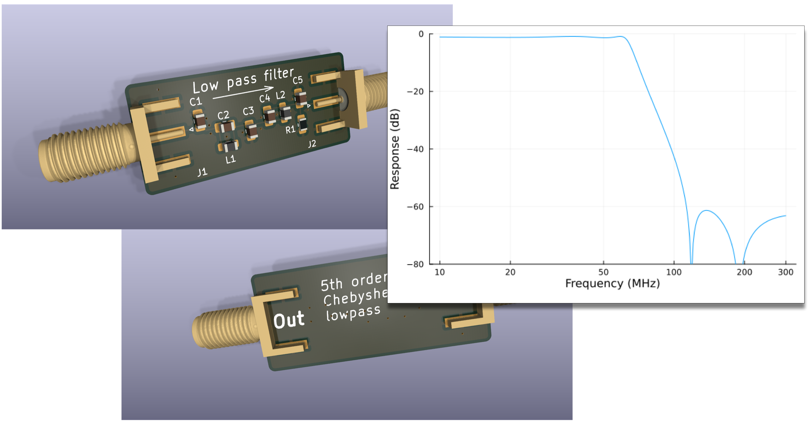

# 5th Order Chebyshev Low Pass Filter

This directory contains the design for a low-pass filter designed with
anti-aliasing in mind and laid out to avoid inadvertent coupling.

A typical use might be on the output of a direct synthesis chip such
as the AD9851. The DAC in an AD9851 is clocked at 180Ms/s which gives
rise to sampling noise at 180MHz. In addition, if you are generating a
waveform at frequency $f$, there will be an image in frequency space
of that output at $180MHz - f$. This filter is intended to suppress
such unwanted signals.

The circuit here is designed for the specific case of sampling at
180MHz and allowing outputs up to 60Mhz, while suppressing undesirable
outputs by at least 60dB. One of the filter poles is specially
adjusted to fall directly on the sampling frequency for maximum
suppression.

The design is also tuned to give very flat response for an output
impedance of 50 Ω. With a 1kΩ load, the passband response of the
filter alone can show variations in insertion loss of up to 3dB. To
minimize that effect, a 200Ω pre-load resistor is included in the
design. The stopband is relatively insensitive to variations in load.

The primary design here is a 4-layer board in order to minimize the
distance from the signal-carrying traces to the closest ground
plane. The design works nearly as well with a 2-layer board, but there
is noticeable degradation in performance as shown in the image above.

# Licensing

This project is licensed under the MIT license with the idea that the 
circuit designs and layouts are simply a form of software.

Please share and enjoy if you build something cool based on this work.
