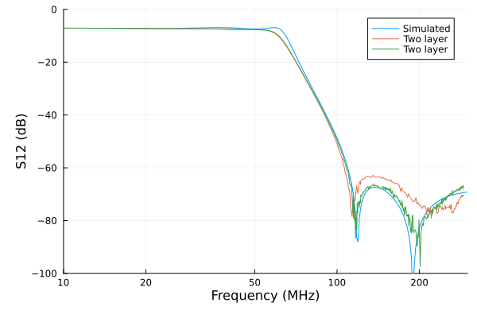

# How Did It Work?

I constructed two versions of the filter, one with four layers and one
implemented with only two layers. Due to the simplicity of the
circuit, the only real different between the two versions was the
distance from the top layer where signal traces were located and the
nearest ground plane. In the four layer board, this distance is about
35μm while on the two layer version, it is about 1600 μm. This is
important because the area of a current loop formed by a
surface-mounted component and the associated return current in the
ground plan is 45 times larger in the case of the two layer board.

This larger area is directly proportional to how effective that
component is crating a magnetic. It is also directly proportional to
how effective a nearby component is at being affected by this
field. That means that the coupling between components is likely to be
2000 times stronger on the two layer board.

That higher coupling does not translate directly into performance that
is 2000 times worse. In many cases, the effect of this coupling is
negligible even if it is 2000 times stronger. The point of building
these two versions of the same board is precisely to see how important
this effect is in a practical setting.

# Data Acquisition

Both versions of the filter were characterized using a nanoVNA
(running firmware NanoVNA-H4 v1.2.27). This particular VNA exhibits
the well-known discontinuity effect when it switches to harmonic mode
at about 291 MHz. All measurements were made in a range from 50 kHz
to 290 MHz to avoid this effect. This range fortuitously matches the
desired range of operation for the filter.

Both S11 and S12 were measured using 10 measurement segments to
provide high resolution in frequency. The `s2p` files from the nanoVNA
were converted to `csv` format to create the `four-layer.csv` and
`two-layer.csv` files in this directory.

# Analysis

The Julia script `plot.jl` was used to put the theoretical and actual
results onto a single plot. Since the theoretical results included the
loss caused by source and load impedances and the nanoVNA compensated
for this loss, the measured results were adjusted to compensate by
offsetting them by -6dB.

